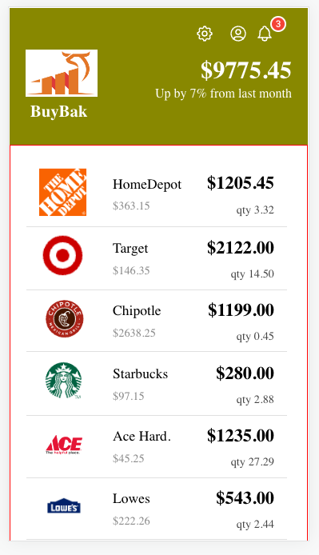
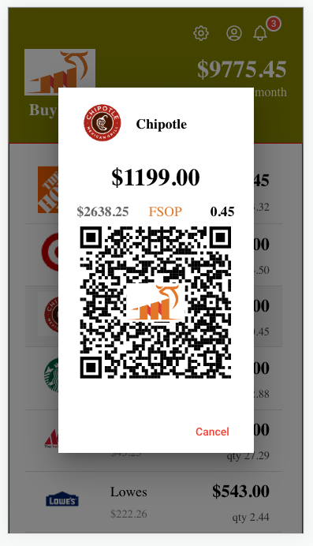
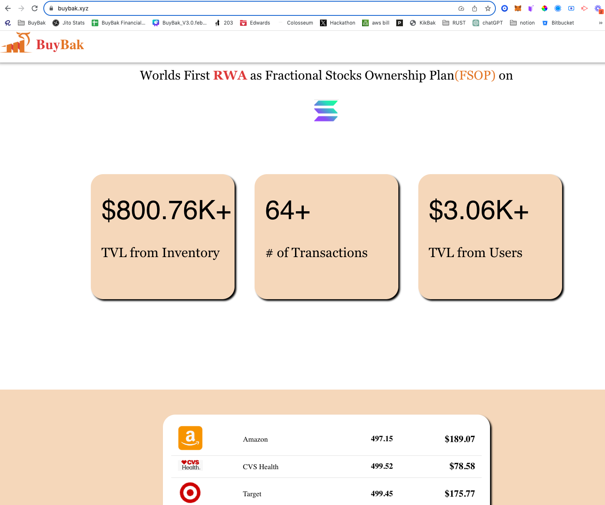
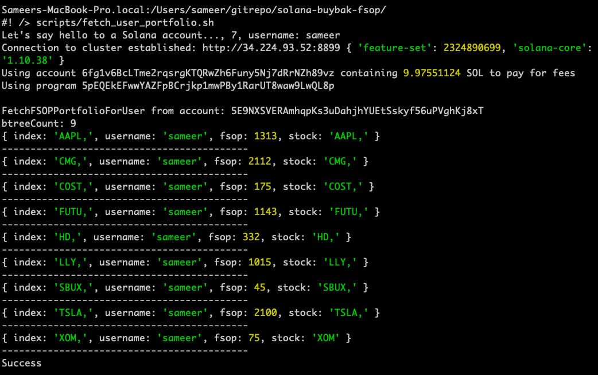
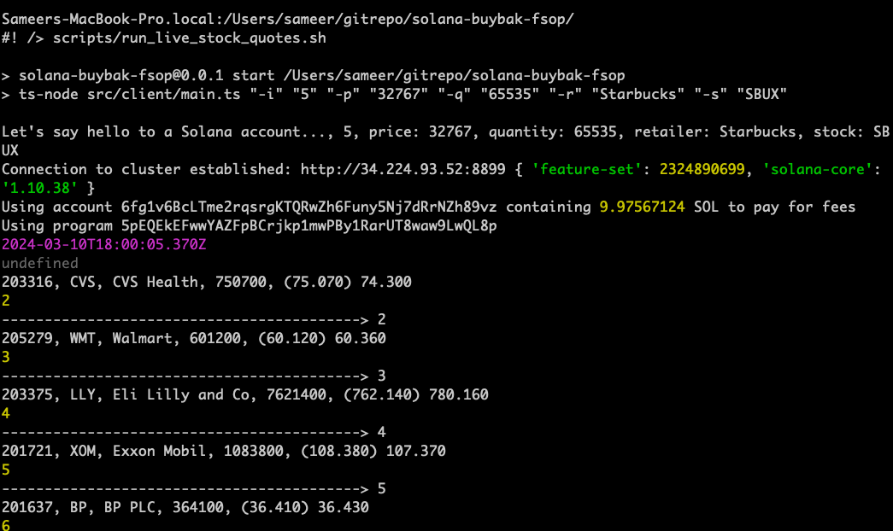
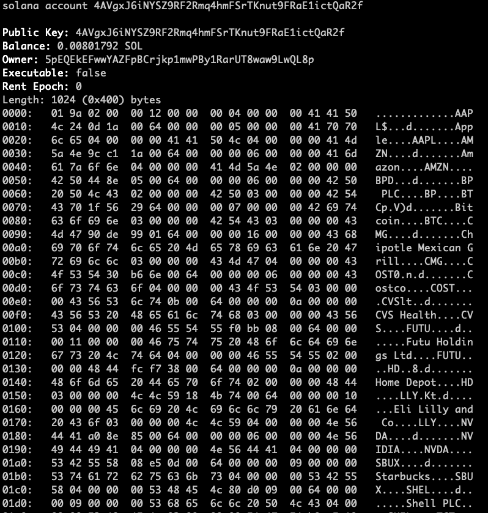
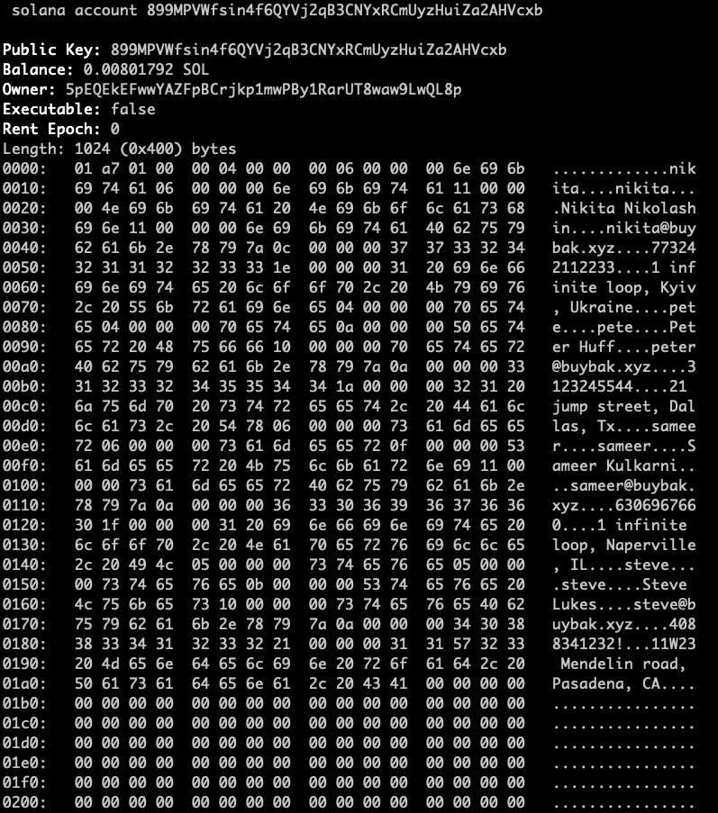
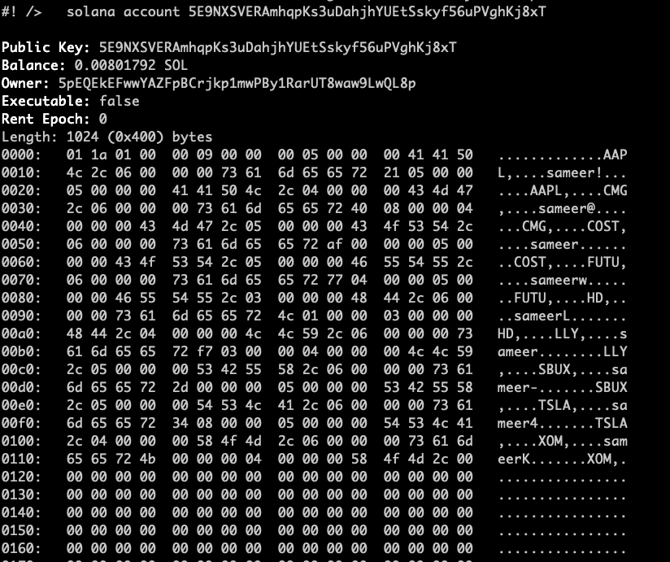

# solana-buybak-fsop
Buybak.xyz Fractional Stock Ownership Plan on SOLANA (preliminary repo)

# Loom Video Link
# https://www.loom.com/share/872c153173db441f9fc23c4ce8e9cd2d?sid=f92d363d-804d-4454-898e-690cf1dbf802

# Dashboard/Mobile repo
https://github.com/purchasense/solana-buybak-dashboard

# How to run
1. ./solana-test-validator --bpf-program solana_buybak_fsop-keypair.json solana_buybak_fsop.so
2. solana config get
    1. Config File: /Users/sameer/.config/solana/cli/config.yml
    2. RPC URL: http://34.224.93.52:8899
    3. WebSocket URL: ws://34.224.93.52:8900/ (computed)
    4. Keypair Path: /Users/sameer/gitrepo/solana/cmdline/my-solana-wallet/my-keypair.json
    5. Commitment: processed
6. solana airdrop 5 (on my-keypair.json)
7. Now run test programs (NodeJS) to populate FSOP aaccounts

    // Create/Update live stocks during the day.

    scripts/run_create_and_update_live_stock_quotes.sh
    scripts/run_live_stock_quotes.sh

    // Create/update user profile/portfolios

    scripts/run_user_profile.sh
    scripts/run_user_portfolio_for_sameer.sh
    scripts/run_user_portfolio_for_nikita.sh
    scripts/run_user_portfolio_for_roman.sh

    // burn user portfolio back into Stocks.

    scripts/run_user_burn_portfolio.sh

8. Output attached herein.

        

