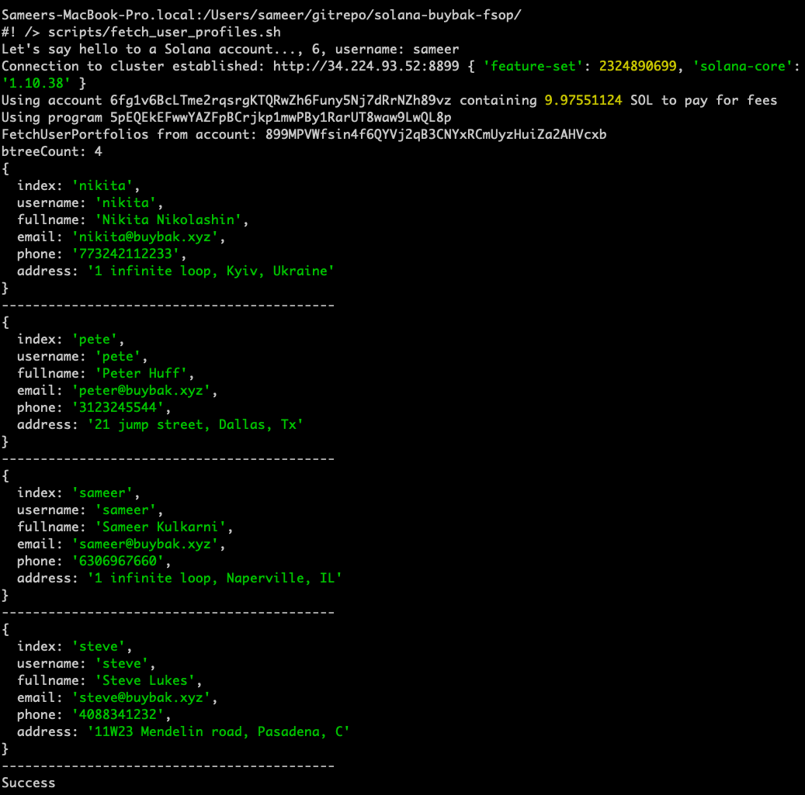

# solana-buybak-fsop
Buybak.xyz Fractional Stock Ownership Plan on SOLANA (preliminary repo)

# How to run
1. ./solana-test-validator --bpf-program solana_buybak_fsop-keypair.json solana_buybak_fsop.so
2. solana config get
    1. Config File: /Users/sameer/.config/solana/cli/config.yml
    2. RPC URL: http://34.224.93.52:8899
    3. WebSocket URL: ws://34.224.93.52:8900/ (computed)
    4. Keypair Path: /Users/sameer/gitrepo/solana/cmdline/my-solana-wallet/my-keypair.json
    5. Commitment: processed
6. solana airdrop 5 (on my-keypair.json)
7. Now run test programs (NodeJS) to populate FSOP aaccounts
    1. run_live_stock_quotes.sh*
    2. run_user_profile.sh*
    3. run_user_portfolio.sh*
    4. fetch_user_portfolio.sh*
    5. fetch_user_profiles.sh*

8. Output attached herein.

        

